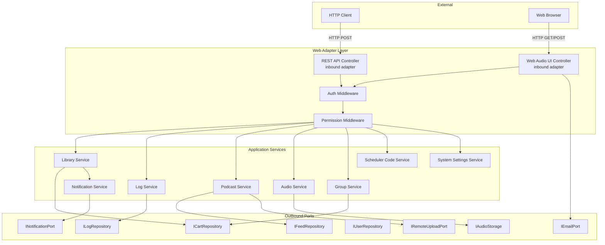
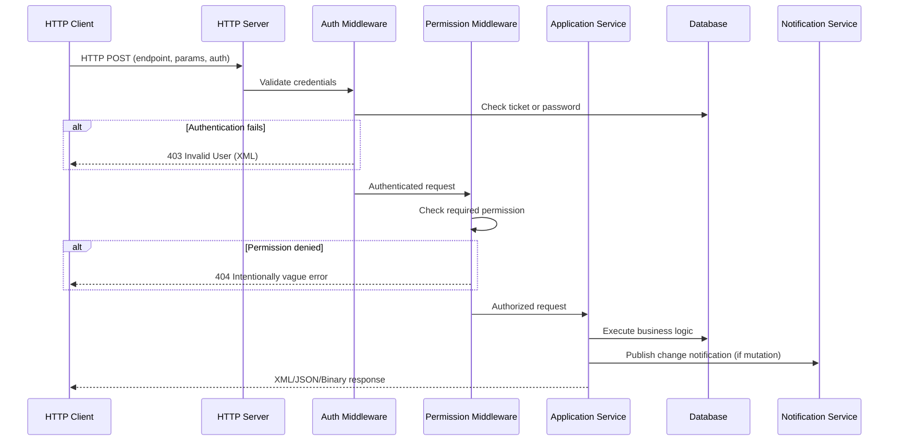
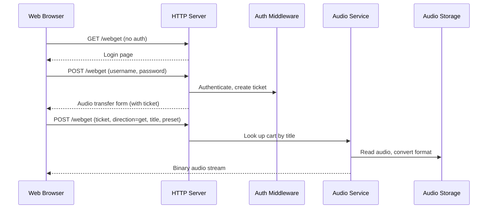
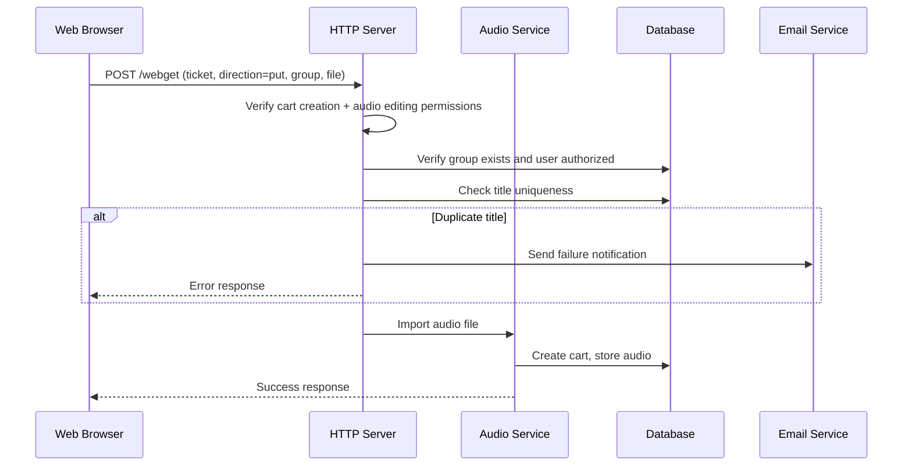
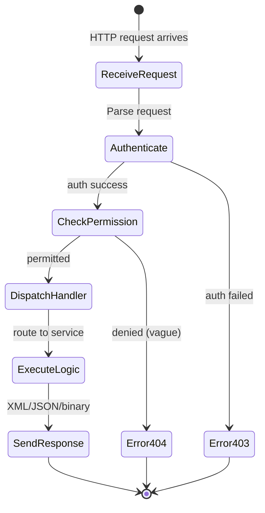
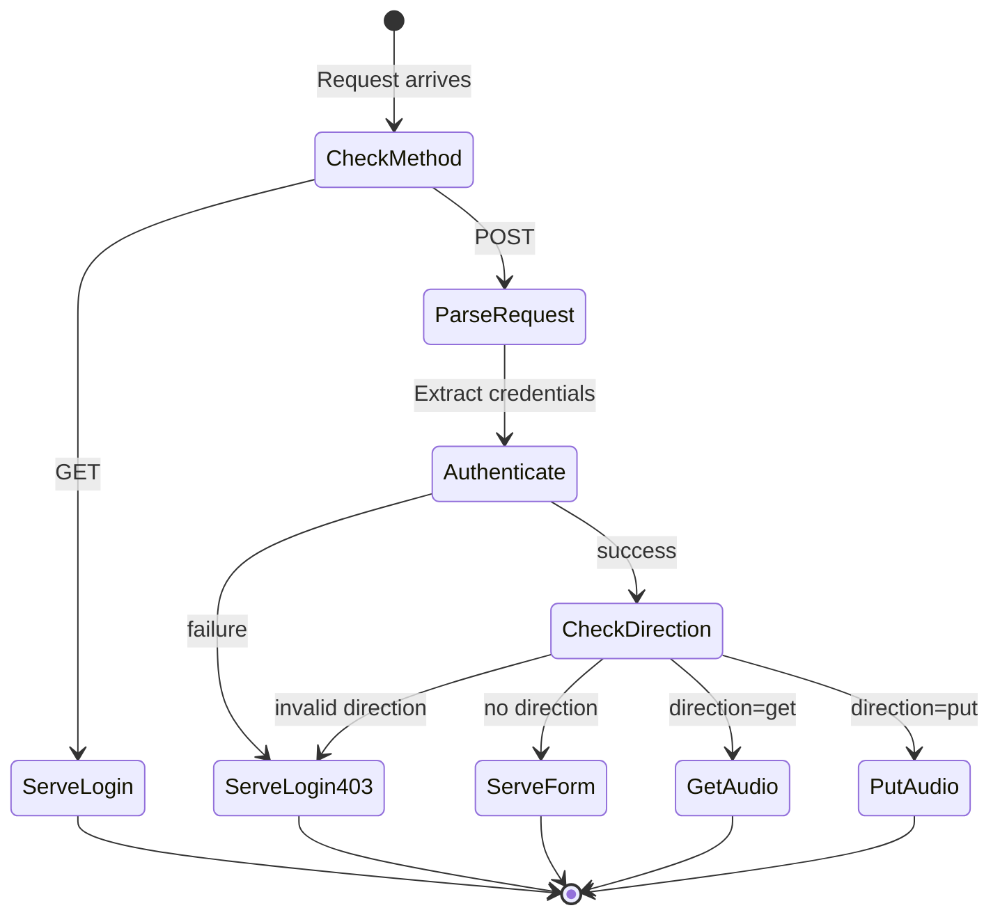
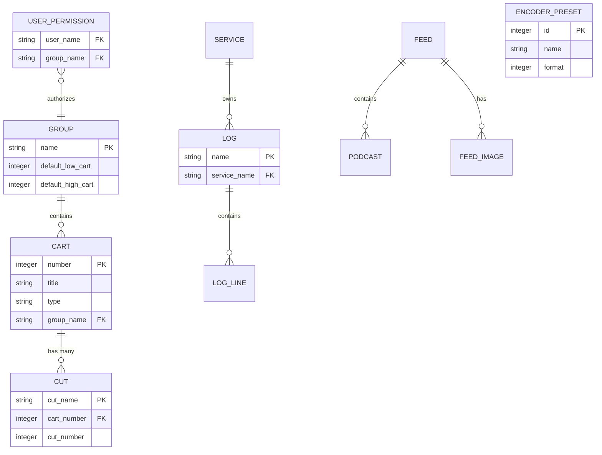

# Design Document: Web API

## Overview

**Purpose:** The Web API delivers HTTP-based access to the Rivendell radio automation system, enabling remote management of carts, cuts, logs, groups, services, scheduler codes, podcasts, and audio files. It serves two distinct audiences: programmatic API clients (automation tools, the C API library, third-party integrations) and browser-based users who need simple audio download/upload without specialized software.

**Users:** System integrators, content managers, audio engineers, program directors, and broadcast operators interact with this feature through HTTP clients or web browsers.

**Impact:** This is the primary external integration surface for Rivendell. All remote operations flow through this API. Changes here affect every external client, the C API library, and browser-based workflows.

### Goals
- Provide a complete REST-like API for all cart, cut, log, group, service, scheduler code, and podcast operations
- Enforce authentication and granular permission checks on every request
- Support audio import/export with format conversion
- Provide a browser-based UI for simple audio get/put operations
- Publish real-time change notifications for data mutations

### Non-Goals
- GraphQL or WebSocket-based APIs (future consideration)
- Streaming/real-time audio playout via HTTP
- Full administrative UI in the browser (admin operations remain in the desktop application)
- Legacy CGI process-per-request architecture (the reimplementation will use a persistent HTTP server)

## Visual Design Reference

All UI/UX implementation decisions (colors, typography, spacing, component appearance, interaction patterns) are defined in the design system files. **Agents implementing UI components MUST read these before writing any visual code.**

| Layer | File | Scope |
|-------|------|-------|
| Global | `.blah/steering/design.md` | Typography, base palette, spacing, z-index, accessibility baseline |
| Spec | `design-system/MASTER.md` | web-specific tokens (colors, states, layout, component specs) |
| Page | `design-system/pages/*.md` | Per-view overrides |

**Hierarchy:** page override > spec MASTER > global steering. Higher layers only define differences.

<!-- NOTE: design-system/ files are generated by the ui-ux-pro-max skill in a separate step.
     If design-system/ does not yet exist, this section serves as a placeholder indicating
     that visual design generation is required before implementation. -->

## Architecture

### Architecture Pattern & Boundary Map

The Web API follows the project-wide hexagonal architecture. The legacy CGI-per-request model is replaced by a persistent HTTP server exposing RESTful endpoints. Domain logic is reused from shared domain and application services; the web layer is an inbound adapter.



### Technology Stack

| Layer | Choice / Version | Role in Feature | Notes |
|-------|------------------|-----------------|-------|
| HTTP Server | Qt Network / QHttpServer | Persistent HTTP server replacing CGI | Single process, multi-request |
| API Format | XML (legacy compat) + JSON (new) | Request/response serialization | XML for backward compatibility with existing clients |
| Authentication | Ticket-based + password | Session management | Tickets issued on password auth |
| Audio Conversion | Qt Multimedia + domain services | Format conversion for import/export | Via IAudioConverter port |
| File Storage | Filesystem adapter | Audio file management | Via IAudioStorage port |
| Notifications | IPC daemon connection | Real-time change propagation | Via INotificationPort |

## System Flows

### API Request Lifecycle



### Browser Audio Download Flow



### Browser Audio Upload Flow



### Command Dispatch State Machine



### Webget Flow State Machine



## Requirements Traceability

| Requirement | Summary | Components | Interfaces | Flows |
|-------------|---------|------------|------------|-------|
| 1 | Authentication & sessions | AuthMiddleware | IUserRepository, ITicketService | API Request Lifecycle |
| 2 | Cart management | RestApiController, CartHandler | ILibraryService, ICartRepository | API Request Lifecycle |
| 3 | Cut management | RestApiController, CutHandler | ILibraryService, ICartRepository | API Request Lifecycle |
| 4 | Audio operations | RestApiController, AudioHandler | IAudioService, IAudioStorage, IAudioConverter | API Request Lifecycle |
| 5 | Log management | RestApiController, LogHandler | ILogService, ILogRepository | API Request Lifecycle |
| 6 | Group & scheduler codes | RestApiController, GroupHandler, SchedCodeHandler | IGroupService, ICartRepository | API Request Lifecycle |
| 7 | Service & system settings | RestApiController, SystemHandler | ISystemSettingsService | API Request Lifecycle |
| 8 | Podcast & RSS | RestApiController, PodcastHandler | IPodcastService, IFeedRepository, IRemoteUploadPort | API Request Lifecycle |
| 9 | Browser audio transfer | WebAudioController | IAudioService, IAudioStorage, IEmailPort | Browser Download/Upload |
| 10 | Permission access control | PermissionMiddleware | IUserRepository | API Request Lifecycle |

## Components and Interfaces

| Component | Domain/Layer | Intent | Req Coverage | Key Dependencies | Contracts |
|-----------|--------------|--------|--------------|------------------|-----------|
| AuthMiddleware | Adapter/Web | Authenticate requests via ticket or password | 1 | IUserRepository (P0) | Service |
| PermissionMiddleware | Adapter/Web | Enforce granular permission checks | 10 | IUserRepository (P0) | Service |
| RestApiController | Adapter/Web | Route API requests to appropriate handlers | 2-8 | All application services (P0) | API |
| WebAudioController | Adapter/Web | Serve browser UI and handle audio transfers | 9 | IAudioService (P0), IEmailPort (P1) | API, State |
| CartHandler | Adapter/Web | Handle cart CRUD API endpoints | 2 | ILibraryService (P0) | API |
| CutHandler | Adapter/Web | Handle cut CRUD API endpoints | 3 | ILibraryService (P0) | API |
| AudioHandler | Adapter/Web | Handle audio import/export/operations | 4 | IAudioService (P0) | API |
| LogHandler | Adapter/Web | Handle log CRUD and locking | 5 | ILogService (P0) | API |
| GroupHandler | Adapter/Web | Handle group listing endpoints | 6 | IGroupService (P0) | API |
| SchedCodeHandler | Adapter/Web | Handle scheduler code operations | 6 | ILibraryService (P0) | API |
| PodcastHandler | Adapter/Web | Handle podcast/RSS operations | 8 | IPodcastService (P0) | API |
| SystemHandler | Adapter/Web | Handle service and system settings endpoints | 7 | ISystemSettingsService (P0) | API |

### Web Adapter Layer

#### AuthMiddleware

| Field | Detail |
|-------|--------|
| Intent | Validate authentication credentials on every incoming request |
| Requirements | 1 |

**Responsibilities & Constraints**
- Validate ticket-based authentication (check ticket validity and expiration)
- Validate password-based authentication (verify username and password)
- Issue new tickets on successful password authentication
- Reject unauthenticated requests with HTTP 403

**Dependencies**
- Outbound: IUserRepository -- user lookup and credential validation (P0)
- Outbound: ITicketService -- ticket creation and validation (P0)

**Contracts**: Service [x]

##### Service Interface
```
interface IAuthMiddleware:
  authenticate(request: HttpRequest) -> Result<AuthenticatedUser, AuthError>
  createTicket(username: string) -> Result<Ticket, AuthError>

AuthError:
  InvalidCredentials | TicketExpired | MissingCredentials
```
- Preconditions: Request contains either TICKET or LOGIN_NAME+PASSWORD
- Postconditions: Returns authenticated user identity or auth error
- Invariants: No request proceeds past this middleware without valid authentication

#### PermissionMiddleware

| Field | Detail |
|-------|--------|
| Intent | Enforce operation-specific permission checks after authentication |
| Requirements | 10 |

**Responsibilities & Constraints**
- Check user permissions against operation requirements
- Return intentionally vague 404 errors when permission is denied (security by obscurity for cart access)
- Support compound permission checks (e.g., save-log requires add + remove + arrange)

**Dependencies**
- Inbound: AuthMiddleware -- authenticated user (P0)
- Outbound: IUserRepository -- permission queries (P0)

**Contracts**: Service [x]

##### Service Interface
```
interface IPermissionMiddleware:
  checkPermission(user: AuthenticatedUser, operation: OperationType, resource: ResourceId) -> Result<void, PermissionError>

OperationType:
  CreateCart | ModifyCart | DeleteCart | EditAudio | CreateLog | DeleteLog |
  SaveLog | AddPodcast | DeletePodcast | AdminConfig | WebgetLogin

PermissionError:
  NotAuthorized (mapped to 404 for carts, 403 for others)
```

#### RestApiController

| Field | Detail |
|-------|--------|
| Intent | Route incoming API requests to the correct handler based on command identifier |
| Requirements | 2, 3, 4, 5, 6, 7, 8 |

**Responsibilities & Constraints**
- Parse command identifier from request
- Dispatch to appropriate handler
- Serialize responses to XML (backward compatible) or JSON
- Send change notifications via notification service after mutations

**Dependencies**
- Inbound: AuthMiddleware, PermissionMiddleware (P0)
- Outbound: All handler components (P0)
- Outbound: INotificationPort -- publish change events (P1)

**Contracts**: API [x] / Event [x]

##### API Contract

| Method | Endpoint | Request | Response | Errors |
|--------|----------|---------|----------|--------|
| POST | /api/carts | AddCart params | Cart XML/JSON | 400, 403, 404, 409 |
| POST | /api/carts/list | ListCarts params | CartList XML/JSON | 403 |
| POST | /api/carts/{id} | ListCart params | Cart XML/JSON | 403, 404 |
| POST | /api/carts/{id}/edit | EditCart params | Cart XML/JSON | 400, 403, 404, 409 |
| POST | /api/carts/{id}/delete | RemoveCart params | OK XML/JSON | 403, 404 |
| POST | /api/cuts | AddCut params | Cut XML/JSON | 403, 404 |
| POST | /api/cuts/list | ListCuts params | CutList XML/JSON | 403, 404 |
| POST | /api/cuts/{id} | ListCut params | Cut XML/JSON | 403, 404 |
| POST | /api/cuts/{id}/edit | EditCut params | Cut XML/JSON | 403, 404 |
| POST | /api/cuts/{id}/delete | RemoveCut params | OK XML/JSON | 403, 404 |
| POST | /api/audio/import | Import params + file | Result XML/JSON | 400, 403, 404, 415, 500 |
| POST | /api/audio/export | Export params | Binary audio stream | 403, 404, 415, 500 |
| POST | /api/audio/delete | DeleteAudio params | OK XML/JSON | 403, 404 |
| POST | /api/audio/copy | CopyAudio params | OK XML/JSON | 403, 404 |
| POST | /api/audio/trim | TrimAudio params | TrimPoint XML/JSON | 403, 404 |
| POST | /api/audio/info | AudioInfo params | AudioInfo XML/JSON | 403, 404 |
| POST | /api/audio/store | -- | AudioStore XML/JSON | 403 |
| POST | /api/audio/peaks | ExportPeaks params | Binary peak data | 403, 404 |
| POST | /api/audio/rehash | Rehash params | OK XML/JSON | 403, 404 |
| POST | /api/logs | AddLog params | OK XML/JSON | 403 |
| POST | /api/logs/list | ListLogs params | LogList XML/JSON | 403 |
| POST | /api/logs/{name} | ListLog params | Log XML/JSON | 403, 404 |
| POST | /api/logs/{name}/save | SaveLog params | OK XML/JSON | 400, 403, 404, 409 |
| POST | /api/logs/{name}/delete | DeleteLog params | OK XML/JSON | 403, 404 |
| POST | /api/logs/{name}/lock | LockLog params | LogLock XML/JSON | 403, 404, 409 |
| POST | /api/groups/list | -- | GroupList XML/JSON | 403 |
| POST | /api/groups/{name} | ListGroup params | Group XML/JSON | 403, 404 |
| POST | /api/schedcodes/list | -- | SchedCodeList XML/JSON | 403 |
| POST | /api/schedcodes/assign | AssignSchedCode params | OK XML/JSON | 403, 404 |
| POST | /api/schedcodes/unassign | UnassignSchedCode params | OK XML/JSON | 403, 404 |
| POST | /api/schedcodes/cart/{id} | ListCartSchedCodes params | SchedCodeList XML/JSON | 403, 404 |
| POST | /api/services/list | -- | ServiceList XML/JSON | 403 |
| POST | /api/system/settings | -- | SystemSettings XML/JSON | 403 |
| POST | /api/podcasts/save | SavePodcast params | OK XML/JSON | 403 |
| POST | /api/podcasts/{id} | GetPodcast params | Podcast XML/JSON | 403, 404 |
| POST | /api/podcasts/{id}/delete | DeletePodcast params | OK XML/JSON | 403, 404 |
| POST | /api/podcasts/{id}/post | PostPodcast params | OK text | 403, 404 |
| POST | /api/podcasts/{id}/remove | RemovePodcast params | OK text | 403, 404 |
| POST | /api/feeds/{id}/rss/post | PostRss params | OK text | 403, 404 |
| POST | /api/feeds/{id}/rss/remove | RemoveRss params | OK text | 403, 404 |
| POST | /api/feeds/{id}/image/post | PostImage params | OK text | 403, 404 |
| POST | /api/feeds/{id}/image/remove | RemoveImage params | OK text | 403, 404 |
| POST | /api/auth/ticket | CreateTicket | Ticket XML/JSON | 403 |

##### Event Contract
- Published events: CartAdded, CartModified, CartDeleted, LogAdded, LogModified
- Subscribed events: none (web layer is a producer, not consumer)
- Delivery: fire-and-forget via INotificationPort to the IPC daemon

#### WebAudioController

| Field | Detail |
|-------|--------|
| Intent | Serve browser-based audio download and upload interface |
| Requirements | 9 |

**Responsibilities & Constraints**
- Serve login page for unauthenticated users
- Serve audio transfer form after authentication
- Handle audio download (search by title, convert format, stream binary)
- Handle audio upload (validate permissions, check uniqueness, import)
- Archive uploaded files when configured
- Send email notification on upload failure

**Dependencies**
- Outbound: IAudioService -- audio conversion and import (P0)
- Outbound: ICartRepository -- cart lookup by title (P0)
- Outbound: IEmailPort -- failure notification emails (P1)
- Outbound: IConfigurationPort -- archive directory setting (P1)

**Contracts**: API [x] / State [x]

##### API Contract

| Method | Endpoint | Request | Response | Errors |
|--------|----------|---------|----------|--------|
| GET | /webget | -- | Login HTML page | -- |
| POST | /webget | LOGIN_NAME, PASSWORD | Audio form HTML (with ticket) | 403 |
| POST | /webget | TICKET, direction=get, title, preset | Binary audio stream | 403, 404 |
| POST | /webget | TICKET, direction=put, group, file | Text result | 400, 403, 404 |

##### State Management
- State model: Stateless per-request (session via ticket in POST data)
- Persistence: Tickets stored in database with expiration
- Concurrency: No server-side session state; each request is independent

## Data Models

### Domain Model

The Web API artifact creates no new domain entities. It operates on entities defined in the core library (LIB):

- **Cart** -- media asset container with metadata (title, artist, album, type, group)
- **Cut** -- individual audio segment within a cart (audio file, cue points, metadata)
- **Log** -- ordered sequence of log lines forming a broadcast schedule
- **LogLine** -- single entry in a log (cart reference, timing, transition type)
- **Group** -- organizational grouping for carts with number range constraints
- **Service** -- broadcast service/station definition
- **SchedulerCode** -- classification code for scheduling algorithms
- **Feed** -- podcast RSS feed definition
- **Podcast** -- individual podcast episode within a feed
- **User** -- system user with permissions and group access
- **EncoderPreset** -- audio format conversion preset (format, bitrate, channels)
- **Ticket** -- temporary authentication token with expiration

### Logical Data Model



### Physical Data Model

All tables are defined and managed by the core library (LIB). The Web API accesses them through repository ports. See the LIB artifact specification for table definitions.

## Error Handling

### Error Strategy

The Web API uses structured error responses mapped to HTTP status codes. Errors are returned as XML (for backward compatibility) or JSON. Security-sensitive errors use intentionally vague messages.

### Error Categories and Responses

**User Errors (4xx):**
- Authentication failure (403): Invalid credentials -- return "Invalid User"
- Missing parameter (400): Required field absent -- return "Missing {field_name}"
- Invalid data (400): Malformed input -- return specific validation message (e.g., "Invalid macro data")
- Duplicate title (404): Title uniqueness violation -- return "Duplicate Cart Title Not Allowed"

**Permission Errors (404 by design):**
- Cart access denied: User lacks group permission -- return "No such cart" (intentionally 404, not 403, to prevent information disclosure)
- Service access denied: User lacks service permission -- return "Unauthorized"

**System Errors (5xx):**
- Server error (500): Internal failure -- return generic error
- Audio format error (415): Unsupported conversion format -- return format-specific error text

### Monitoring
- Log all authentication failures with client address
- Log all permission denials with user identity and requested operation
- Track audio conversion errors for format compatibility monitoring

## Testing Strategy

### Unit Tests
- Authentication middleware: ticket validation, password validation, ticket creation
- Permission middleware: all operation/permission combinations from the permission matrix
- Cart handler: CRUD operations, duplicate title validation, macro validation, group range enforcement
- Log handler: CRUD operations, lock management (create, update, clear, conflict)
- Audio handler: format parameter validation, trim point calculation

### Integration Tests
- Full request lifecycle: HTTP request -> auth -> permission -> handler -> response
- Audio import with format conversion through the audio service
- Audio export with binary streaming
- Podcast upload to mock remote server
- Log save with concurrent lock contention
- Cart operations across group boundaries

### E2E Tests
- Browser login flow: navigate to webget, enter credentials, see audio form
- Audio download: login, enter cart title, select format, receive audio file
- Audio upload: login, select file and group, upload, verify cart created
- Session expiry: login, wait for ticket expiration, verify redirect to login
- Permission enforcement: login as restricted user, verify upload section hidden

### Performance
- Concurrent API request handling (multiple simultaneous CRUD operations)
- Large audio file export streaming (verify memory-efficient streaming, not full buffering)
- Bulk cart listing with many results (pagination behavior)
