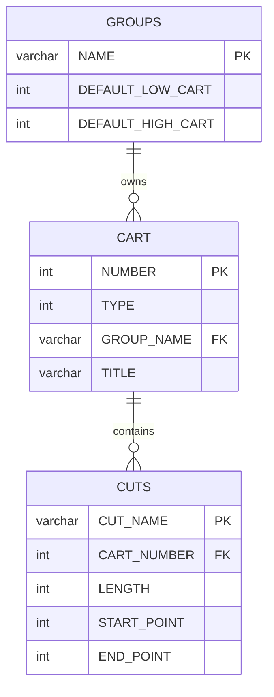
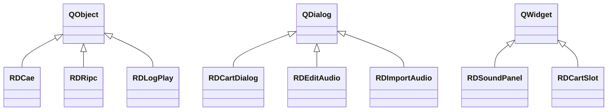
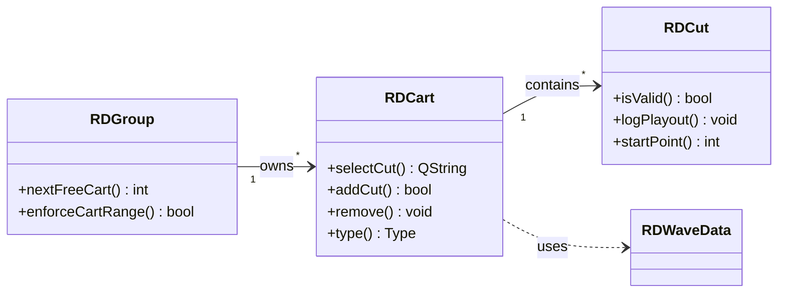

# PHASE-2 — Inventory Build Agent (Orchestrator)
## Wersja: 1.3.0 | Faza: 2 | Scope: per artifact

---

## Krok 0: Bootstrap Serena MCP (OBOWIĄZKOWY)

**Wykonaj PRZED jakąkolwiek pracą z kodem:**
1. `ToolSearch(query="+serena", max_results=50)` — pobierze definicje narzędzi Serena MCP
2. Wywołaj `mcp__serena__initial_instructions()` — inicjalizacja Sereny
3. Dopiero potem kontynuuj normalną pracę

> ⚠️ Bez tego kroku narzędzia Serena NIE BĘDĄ DOSTĘPNE — są to deferred tools wymagające jawnego pobrania.

---

## Cel

Zbudować pełny inwentarz: klasy, metody, sygnały, sloty, **schemat DB**, **diagramy klas i ERD**.
Uruchamia sub-agentów równolegle (jeden per para .h/.cpp), merge agent konsoliduje.

**Outputy Phase 2:**
- `inventory.md` — inwentarz klas z API, sygnałami, regułami
- **`data-model.md`** — schemat DB (tabele, kolumny, FK, ERD) ← NOWE
- **Diagramy Mermaid** wbudowane w oba pliki ← NOWE

---

## Wejście

```
Typ:        artifact ID
Źródło:     .analysis/{ARTIFACT_ID}/discovery-state.md
Walidacja:
  - discovery-state.md istnieje
  - frontmatter: phase=1, status=done
```

---

## Kroki wykonania

### Krok 1 — Załaduj listę plików z discovery-state.md

Przeczytaj sekcję "Pliki źródłowe" z discovery-state.md.
Zbuduj listę par: `[("cart.h", "cart.cpp"), ("cut.h", "cut.cpp"), ...]`

Obsługa przypadków brzegowych:
- plik .h bez .cpp → analyze tylko header (klasa może być template/inline)
- plik .cpp bez .h → analyze implementację bezpośrednio (może być main.cpp)
- pliki `moc_*.cpp` → POMIŃ (generowane przez moc)
- pliki `ui_*.h` → POMIŃ (generowane z .ui plików, analizowane w Fazie 3)

### Krok 1b — Skanuj WSZYSTKIE klasy (nie tylko Q_OBJECT)

> **WAŻNE:** Wiele projektów Qt ma klasy plain C++ (Active Record, Value Object,
> helper/utility) BEZ makra Q_OBJECT. Te klasy NIE pojawiają się w skanowaniu
> sygnałów/slotów ale SĄ częścią domain model i muszą być zinwentaryzowane.

```
# Znajdź WSZYSTKIE klasy C++ w artifact folder
Serena: search_for_pattern(
  substring_pattern="^class\\s+\\w+",
  relative_path="{ARTIFACT_FOLDER}",
  paths_include_glob="**/*.h"
)
→ LISTA_WSZYSTKIE

# Porównaj z listą Q_OBJECT klas z discovery-state.md
PLAIN_CPP = LISTA_WSZYSTKIE - LISTA_QOBJECT
```

**Kategoryzacja plain C++ klas:**
```
Klasa z getterami/setterami + SQL            → Active Record (CRUD model)
Klasa z samymi metodami statycznymi          → Utility
Klasa z enum'ami i stałymi                   → Value Object / Constants
Klasa z algorytmami                          → Service (non-Qt)
struct / klasa z samymi polami               → Data Transfer Object
```

### Krok 2 — Uruchom sub-agenty równolegle

Dla każdej pary plików uruchom `.claude/agents/PHASE-2-inventory-subagent.md` z parametrami:
```
ARTIFACT_ID:  {ARTIFACT_ID}
HEADER_FILE:  {ścieżka do .h}
SOURCE_FILE:  {ścieżka do .cpp lub null}
PARTIAL_ID:   {NR}  (sekwencyjny numer, np. 001, 002, ...)
```

Sub-agent zapisuje wynik do:
```
.analysis/{ARTIFACT_ID}/_partials/inv-{PARTIAL_ID}-{CLASSNAME}.md
```

Priorytet kolejności sub-agentów:
1. Klasy dziedziczące bezpośrednio z QObject (core domain)
2. Klasy dziedziczące z QDialog/QMainWindow (UI)
3. Klasy utility i helper

### Krok 3 — Ekstrakcja Data Model (schemat DB) ← NOWE

> Osobny krok — nie jest częścią sub-agentów per klasa.
> Wyciąga schemat bazy danych i mapuje tabele na klasy C++.

**3a — Znajdź definicje tabel**

```
# Szukaj CREATE TABLE w całym projekcie (schemat może być poza artifact folder)
Serena: search_for_pattern(
  substring_pattern="create table",
  paths_include_glob="**/*.{cpp,sql,h}",
  context_lines_after=30
)
→ Lista tabel z kolumnami

# Typowa lokalizacja schematu w projektach Rivendell:
# utils/rddbmgr/create.cpp (schema version managed)
# Ale szukaj też w artifact folder (embedded SQL)
```

**3b — Mapuj tabele na klasy CRUD**

```
# Dla każdej znalezionej tabeli, szukaj klas które ją używają
Serena: search_for_pattern(
  substring_pattern="from {TABLE_NAME}|into {TABLE_NAME}|update {TABLE_NAME}",
  relative_path="{ARTIFACT_FOLDER}",
  paths_include_glob="**/*.cpp"
)
→ Mapowanie: TABELA → lista klas C++ które robią CRUD na niej
```

**3c — Zidentyfikuj wzorzec persystencji**

Dla każdej klasy Active Record (z Kroku 1b):
```
Serena: search_for_pattern(
  substring_pattern="QSqlQuery|RDSqlQuery",
  relative_path="{SOURCE_FILE}",
  context_lines_after=2
)
→ Wyciągnij: SELECT (read), INSERT (create), UPDATE (update), DELETE (delete)
→ Które kolumny tabeli klasa odczytuje/zapisuje?
```

**3d — Generuj diagram ERD (Mermaid)**



**3e — Zapisz data-model.md**

Output: `.analysis/{ARTIFACT_ID}/data-model.md`

```markdown
---
phase: 2
artifact: {ARTIFACT_ID}
status: done
tables_total: {N}
crud_classes: {N}
---

# Data Model: {ARTIFACT_NAME}

## ERD — Entity Relationship Diagram

```mermaid
erDiagram
    {pełny diagram}
```

## Tabele

### {TABLE_NAME}

| Kolumna | Typ | Null | Default | Opis |
|---------|-----|------|---------|------|
| {col} | {typ} | YES/NO | {def} | {opis} |

**Klasy CRUD:** {lista klas C++ operujących na tej tabeli}
**Operacje:** CREATE / READ / UPDATE / DELETE

### Relacje FK

| Tabela źródłowa | Kolumna | → Tabela docelowa | Kolumna PK |
|-----------------|---------|-------------------|-----------|

## Mapowanie Tabela ↔ Klasa C++

| Tabela DB | Klasa C++ | Wzorzec | Operacje |
|-----------|-----------|---------|----------|
| CART | RDCart | Active Record | CRUD |
| CUTS | RDCut | Active Record | CRUD |
| USERS | RDUser | Active Record | CRUD |
| LOG_LINES | RDLogLine | Value Object (read-only w librd) | R |
```

### Krok 4 — Generuj diagramy klas (Mermaid) ← NOWE

Po zebraniu wszystkich partial plików, wygeneruj diagram klas.

**4a — Diagram dziedziczenia (per kategoria)**



**4b — Diagram zależności (klasy domenowe)**



**Reguły generowania diagramu klas:**
- Pokaż TYLKO publiczne metody z znaczeniem biznesowym (nie gettery/settery)
- Pokaż relacje: dziedziczenie (`<|--`), kompozycja (`-->`), użycie (`..>`)
- Pogrupuj klasy per kategoria (Communication, Audio, Model, UI, Utility)
- Nie rysuj klas z <5 członkami jako osobny prostokąt — zbyt zagracone
- Max ~20 klas na diagram — podziel na osobne jeśli więcej

**4c — Dodaj diagramy do inventory.md**

Na początku inventory.md (po statystykach) dodaj sekcje:
```markdown
## Diagram klas — dziedziczenie
```mermaid
{diagram 4a}
```

## Diagram klas — zależności domenowe
```mermaid
{diagram 4b}
```
```

### Krok 5 — Wywołaj Merge Agent

Uruchom `.claude/agents/MERGE-AGENT.md` z parametrami:
```
ARTIFACT_ID:     {ARTIFACT_ID}
PHASE:           2
PARTIAL_PATTERN: inv-*.md
OUTPUT_FILE:     inventory.md
TEMPLATE:        .claude/templates/inventory.md
```

### Krok 6 — Walidacja output

Po merge sprawdź inventory.md:
```
- Każda klasa z discovery-state.md ma wpis w inventory.md?
- Żadna klasa nie jest zduplikowana?
- Każda klasa z Q_OBJECT ma sekcję sygnałów i slotów?
- Liczba klas w inventory >= liczba klas ze skanu (Krok 1b)?
- data-model.md istnieje z ERD?
- Diagramy klas Mermaid są w inventory.md?
```

Jeśli brakuje klas → uruchom ponownie sub-agenta dla tych par.

### Krok 7 — Spot-check (OBOWIĄZKOWY)

Wybierz **3 losowe klasy** (mix: 1 QObject, 1 Dialog, 1 plain C++).

Dla każdej:
```
# Zweryfikuj sygnały
Serena: search_for_pattern(
  substring_pattern="signals:",
  relative_path="{HEADER_FILE}",
  context_lines_after=30
)

# Zweryfikuj CRUD mapowanie (dla Active Record klas)
Serena: search_for_pattern(
  substring_pattern="from {TABLE}|into {TABLE}",
  relative_path="{SOURCE_FILE}"
)
→ Czy tabela w data-model.md jest prawidłowo zmapowana na tę klasę?
```

Jeśli >=1 rozbieżność → popraw.

---

## Warunek done

```
inventory.md istnieje z frontmatter phase=2, status=done
data-model.md istnieje z ERD Mermaid i mapowaniem tabela↔klasa
Diagramy klas (dziedziczenie + zależności) w inventory.md
Liczba klas w inventory >= z discovery-state.md
Spot-check 3 klas przeszedł
Kolumna P2 w manifest.md → done
```

**Po zakończeniu**: zmień kolumnę **P2** w tabeli Artifacts manifestu na done.

## Co dalej

Fazy 3 i 4 mogą startować równolegle:
- `/qtre-phase-3-ui-extraction ARTIFACT_ID`
- `/qtre-phase-4-call-graph ARTIFACT_ID`
