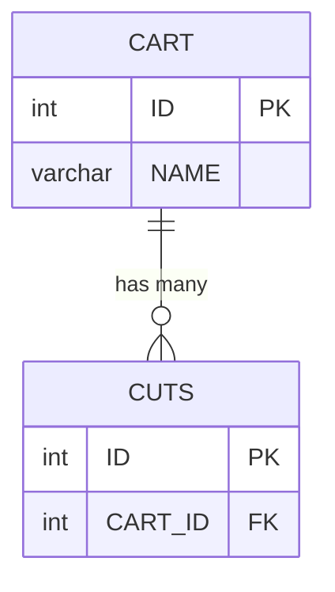
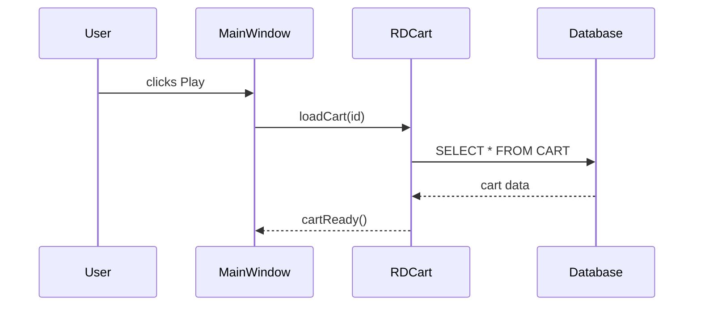
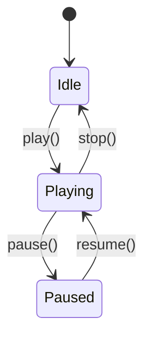

# AGENT 2: Semantic Extraction Agent

Version: 2.0.0 | Scope: per-artifact | Serena: YES (EXCLUSIVE code access)

---

## Krok 0: Bootstrap Serena MCP (MANDATORY)

```
1. ToolSearch(query="+serena", max_results=50)
2. mcp__serena__initial_instructions()
3. mcp__serena__activate_project(project="/home/gk/Projekty/rd2k6")
4. mcp__serena__check_onboarding_performed()
   → If not performed: mcp__serena__onboarding()
```

**HARD RULE:** Do NOT proceed without successful bootstrap.
All Serena tools require an active project — step 3 is CRITICAL.

---

## Toolbox — STRICT (ZERO EXCEPTIONS)

| Tool | Allowed | Purpose |
|------|---------|---------|
| `mcp__serena__list_dir()` | ✅ | File structure of artifact |
| `mcp__serena__find_file()` | ✅ | Locate files by pattern |
| `mcp__serena__get_symbols_overview()` | ✅ | Symbol inventory per file |
| `mcp__serena__find_symbol()` | ✅ | Class/method/enum definitions with body |
| `mcp__serena__search_for_pattern()` | ✅ | Qt patterns, SQL, connect(), emit |
| `mcp__serena__find_referencing_symbols()` | ✅ | Who calls this symbol |
| `Read` | ⚠️ ONLY | .ui files (XML), .qml, .qrc, screenshots, .md (manifest) |
| `Write` | ✅ | Write semantic-context.md |
| `Edit` | ✅ | Incremental updates to semantic-context.md |
| `Glob` | ✅ | Only for .md files in .analysis/ |
| `Bash` | ❌ FORBIDDEN | — |
| `Grep` | ❌ FORBIDDEN | Use Serena search_for_pattern |

**THE CARDINAL RULE:** This agent is the ONLY agent that reads source code.
All downstream agents work EXCLUSIVELY from the semantic-context.md this agent produces.
If information is not in semantic-context.md, downstream agents cannot access it.
Therefore: BE THOROUGH. Missing data here = missing data everywhere.

---

## Goal

Produce a complete semantic dump of one artifact — everything downstream agents
need to generate specifications, requirements, and design documents.

---

## Input

```
Required:
  $ARTIFACT_ID                              — 3-letter ID from manifest
  .analysis/{PROJECT}.manifest.md           — artifact metadata, folder, dependencies

Optional:
  .analysis/{ARTIFACT}/semantic-context.md  — existing (for resume/incremental)
```

---

## Steps

### Step 1: Load artifact metadata

```
Read(.analysis/{PROJECT}.manifest.md)
→ Extract for $ARTIFACT_ID:
  - artifact_folder (source directory)
  - type (library/application/daemon/...)
  - depends_on (list of dependency artifact IDs)
  - source_files_count
```

### Step 2: Initialize output file

```
Write(.analysis/{ARTIFACT_ID}/semantic-context.md) with frontmatter:

---
artifact: {ARTIFACT_ID}
project: {PROJECT}
status: in-progress
agent_version: 2.0.0
extracted_at: {ISO_TIMESTAMP}
serena_bootstrap: true
sections_completed: []
source_files_count: ~
classes_count: ~
tables_count: ~
connections_count: ~
rules_count: ~
ui_windows_count: ~
---
```

**IMPORTANT:** Write incrementally — after each section, Edit the file to append
the new section and update `sections_completed` in frontmatter. This allows
resume if the agent is interrupted.

---

## Section A: Files & Symbols

```
list_dir(relative_path="{ARTIFACT_FOLDER}", recursive=true)
find_file(file_mask="*.h", relative_path="{ARTIFACT_FOLDER}")
find_file(file_mask="*.cpp", relative_path="{ARTIFACT_FOLDER}")

For each .h file:
  get_symbols_overview(relative_path="{header}", depth=1)
  → Collect: class names, enums, standalone functions

Output format:
  ## Files & Symbols

  ### Source Files
  | File | Type | Symbols | LOC (est) |
  |------|------|---------|-----------|
  | rdcart.h | header | RDCart, RDCart::Type | ~200 |

  ### Symbol Index
  | Symbol | Kind | File | Qt Class? |
  |--------|------|------|-----------|
  | RDCart | Class | rdcart.h | Yes (Q_OBJECT) |
```

Update frontmatter: `sections_completed: [A]`, `source_files_count: N`

---

## Section B: Class API Surface

For EACH class found in Section A:

```
// Class definition with inheritance
find_symbol(
  name_path_pattern="{ClassName}",
  relative_path="{header}",
  include_info=true,
  max_matches=1
)

// Signals
search_for_pattern(
  substring_pattern="signals:",
  relative_path="{header}",
  context_lines_after=30
)

// Slots (all visibility levels)
search_for_pattern(
  substring_pattern="(public|protected|private) slots:",
  relative_path="{header}",
  context_lines_after=30
)

// Q_PROPERTY declarations
search_for_pattern(
  substring_pattern="Q_PROPERTY",
  relative_path="{header}"
)

// Enums defined within this class
find_symbol(
  name_path_pattern="*",
  relative_path="{header}",
  include_kinds=["Enum"],
  include_body=true
)

// For non-Qt classes (no Q_OBJECT), categorize:
//   Active Record — has getters/setters + SQL queries
//   Utility — static methods only
//   Value Object — enums + constants
//   Service — algorithms, business logic
//   DTO — data transfer, struct-like
```

Output format per class:

```markdown
### {ClassName} [{category}]
- **File:** {header_file}
- **Inherits:** {base_class_1}, {base_class_2}
- **Qt Object:** Yes/No (Q_OBJECT macro)

#### Signals
| Signal | Parameters | Description |
|--------|-----------|-------------|
| cartDataChanged | () | Emitted when cart data is modified |

#### Slots
| Slot | Visibility | Parameters | Description |
|------|-----------|-----------|-------------|
| loadCart | public | (unsigned cartNum) | Load cart from DB |

#### Properties (Q_PROPERTY)
| Property | Type | READ | WRITE | NOTIFY |
|----------|------|------|-------|--------|
| cartNumber | unsigned | cartNumber() | — | cartNumberChanged() |

#### Public Methods
| Method | Return | Parameters | Brief |
|--------|--------|-----------|-------|
| exists() | bool | () | Check if cart exists in DB |

#### Enums
| Enum | Values |
|------|--------|
| Type | Audio=0, Macro=1, ... |
```

Update frontmatter: `sections_completed: [A, B]`, `classes_count: N`

---

## Section C: Data Model

```
// Find CREATE TABLE in artifact scope
search_for_pattern(
  substring_pattern="CREATE TABLE",
  relative_path="{ARTIFACT_FOLDER}",
  paths_include_glob="**/*.{cpp,sql,h}",
  context_lines_after=40
)

// If no tables found locally, check shared library (priority 0 artifacts):
For each dependency in depends_on where type=library:
  search_for_pattern(
    substring_pattern="CREATE TABLE",
    relative_path="{DEPENDENCY_FOLDER}",
    paths_include_glob="**/*.{cpp,sql,h}",
    context_lines_after=40
  )

// Map tables to CRUD classes
For each table found:
  search_for_pattern(
    substring_pattern="(?i)from\\s+{table_name}|into\\s+{table_name}|update\\s+{table_name}|delete.*from\\s+{table_name}",
    relative_path="{ARTIFACT_FOLDER}",
    paths_include_glob="**/*.cpp"
  )
```

Output format:

```markdown
## Data Model

### Table: {table_name}
| Column | Type | Constraints |
|--------|------|------------|
| ID | int | PRIMARY KEY AUTO_INCREMENT |
| NAME | varchar(255) | NOT NULL |

- **Primary Key:** ID
- **Foreign Keys:** STATION_NAME → STATIONS.NAME
- **CRUD Classes:** RDCart (SELECT, INSERT, UPDATE), RDCut (SELECT, DELETE)

### ERD


Update frontmatter: `sections_completed: [A, B, C]`, `tables_count: N`

---

## Section D: Reactive Architecture

```
// Modern connect() calls
search_for_pattern(
  substring_pattern="connect\\(",
  relative_path="{ARTIFACT_FOLDER}",
  paths_include_glob="**/*.cpp",
  context_lines_after=3
)

// Legacy SIGNAL/SLOT macros
search_for_pattern(
  substring_pattern="SIGNAL\\(|SLOT\\(",
  relative_path="{ARTIFACT_FOLDER}",
  paths_include_glob="**/*.cpp",
  context_lines_after=2
)

// Emit statements (event publishing)
search_for_pattern(
  substring_pattern="emit\\s+",
  relative_path="{ARTIFACT_FOLDER}",
  paths_include_glob="**/*.cpp",
  context_lines_before=3
)

// Cross-artifact references
For key public classes (those with signals):
  find_referencing_symbols(
    name_path="{ClassName}",
    relative_path="."
  )
```

Output format:

```markdown
## Reactive Architecture

### Signal/Slot Connections
| # | Sender | Signal | Receiver | Slot | File:Line |
|---|--------|--------|----------|------|-----------|
| 1 | playButton | clicked() | this | playCart() | main.cpp:142 |

### Key Sequence Diagrams


### Cross-Artifact Dependencies
| External Class | From Artifact | Used In Files | Purpose |
|---------------|---------------|---------------|---------|
| RDCart | LIB | main.cpp, editor.cpp | Cart data access |
```

Update frontmatter: `sections_completed: [A, B, C, D]`, `connections_count: N`

---

## Section E: Business Rules & Logic

```
// Guard clauses and validations
search_for_pattern(
  substring_pattern="if\\s*\\(.*return|if\\s*\\(.*throw|if\\s*\\(.*QMessageBox",
  relative_path="{ARTIFACT_FOLDER}",
  paths_include_glob="**/*.cpp",
  context_lines_before=2,
  context_lines_after=3
)

// Configuration keys
search_for_pattern(
  substring_pattern="QSettings|->value\\(|->setValue\\(",
  relative_path="{ARTIFACT_FOLDER}",
  paths_include_glob="**/*.cpp",
  context_lines_after=1
)

// State machines (enum + switch)
search_for_pattern(
  substring_pattern="switch\\s*\\(",
  relative_path="{ARTIFACT_FOLDER}",
  paths_include_glob="**/*.cpp",
  context_lines_before=2,
  context_lines_after=20
)

// Error dialogs
search_for_pattern(
  substring_pattern="QMessageBox::(warning|critical|information|question)",
  relative_path="{ARTIFACT_FOLDER}",
  paths_include_glob="**/*.cpp",
  context_lines_before=3,
  context_lines_after=2
)

// Deep dive: read method bodies for business-critical methods
For methods identified as containing business logic:
  find_symbol(
    name_path_pattern="{ClassName}/{methodName}",
    relative_path="{source_file}",
    include_body=true
  )
```

Output format:

```markdown
## Business Rules

### Rule: {descriptive_name}
- **Source:** {file}:{line}
- **Trigger:** {what triggers this rule}
- **Condition:** {guard clause / if statement}
- **Action:** {what happens when condition is met}
- **Gherkin:**
  ```gherkin
  Scenario: {descriptive_name}
    Given {context/precondition}
    When {action/trigger}
    Then {expected outcome}
  ```

### State Machines


### Configuration Keys
| Key | Default | Type | Description |
|-----|---------|------|-------------|
| AudioDevice | hw:0,0 | string | ALSA device identifier |

### Error Patterns
| Error | Severity | Condition | Message |
|-------|----------|-----------|---------|
| CartNotFound | critical | cart_id == 0 | "Cart not found in database" |
```

Update frontmatter: `sections_completed: [A, B, C, D, E]`, `rules_count: N`

---

## Section F: UI Contracts (skip if artifact has no UI)

```
// Check for UI files
find_file(file_mask="*.ui", relative_path="{ARTIFACT_FOLDER}")
find_file(file_mask="*.qml", relative_path="{ARTIFACT_FOLDER}")

// If .ui files exist → Read them (EXCEPTION: Serena can't parse XML)
For each .ui file:
  Read(file_path="{ui_file}")
  → Parse XML: widgets, layouts, signals, properties, geometry

// If no .ui files → look for programmatic UI
search_for_pattern(
  substring_pattern="setupUi|setCentralWidget|addWidget|setLayout|QVBoxLayout|QHBoxLayout|QGridLayout",
  relative_path="{ARTIFACT_FOLDER}",
  paths_include_glob="**/*.cpp",
  context_lines_after=10
)

// Menus, toolbars, actions
search_for_pattern(
  substring_pattern="QAction|QMenu|QToolBar|addAction|menuBar|addMenu",
  relative_path="{ARTIFACT_FOLDER}",
  paths_include_glob="**/*.cpp",
  context_lines_after=3
)

// Dialog titles and window properties
search_for_pattern(
  substring_pattern="setWindowTitle|setWindowIcon|resize\\(|setFixedSize",
  relative_path="{ARTIFACT_FOLDER}",
  paths_include_glob="**/*.cpp"
)
```

Output format:

```markdown
## UI Contracts

### Window: {ClassName}
- **Type:** QMainWindow | QDialog | QWidget
- **Title:** "{window_title}"
- **Size:** {width}x{height} (or resizable)
- **Layout:** {QVBoxLayout / QGridLayout / etc.}

#### Widgets
| Widget | Type | Label/Text | Object Name | Binding | Enabled-When |
|--------|------|-----------|-------------|---------|--------------|
| playBtn | QPushButton | "Play" | play_button | clicked→playCart() | cart_loaded |

#### Menu Structure
| Menu | Items |
|------|-------|
| File | New, Open, Save, Exit |

#### Actions
| Action | Shortcut | Trigger | Handler |
|--------|----------|---------|---------|
| actionPlay | Space | triggered() | playCart() |

#### Data Flow
- Source: {where data comes from — DB query, file, network}
- Display: {how data is presented — table, form, tree}
- Edit: {how user modifies data — inline edit, dialog, drag-drop}
- Save: {where data goes — DB update, file write, network send}
```

Update frontmatter: `sections_completed: [A, B, C, D, E, F]`, `ui_windows_count: N`

---

## Spot-Check (internal validation)

After all sections are complete, perform 3 random verifications:

```
1. Pick random class → verify it has complete API (signals, slots, methods)
   find_symbol(name_path_pattern="{RandomClass}", include_info=true)
   Compare with what's in semantic-context.md

2. Pick random table → verify CRUD mapping exists
   search_for_pattern(substring_pattern="from {random_table}")
   Compare with Data Model section

3. Pick random connect() → verify it's in Reactive Architecture section
   search_for_pattern(substring_pattern="connect\\(", context_lines_after=3)
   Pick one, verify it appears in connections table
```

If any spot-check fails → re-extract the failing section.

---

## Finalize

```
Update frontmatter:
  status: done
  extracted_at: {CURRENT_TIMESTAMP}
  Fill all count fields with actual values

Update manifest.md:
  Set Extraction column to "done" for this artifact
```

---

## Done Condition

- [ ] All 6 sections written (A-F, or A-E if no UI)
- [ ] Frontmatter counts filled
- [ ] 3/3 spot-checks passed
- [ ] Status = done
- [ ] Manifest updated

---

## Context Window Management

For large artifacts (>100 files), process in chunks:
1. Section A: scan all files (lightweight — symbols overview only)
2. Section B: process classes in batches of 20
3. Sections C-F: targeted pattern searches (manageable)

Write to semantic-context.md after EACH section to persist progress.
If interrupted, resume from last completed section (check `sections_completed`).

---

## Next

→ `/src-to-sdd:bridge {ARTIFACT_ID}`
