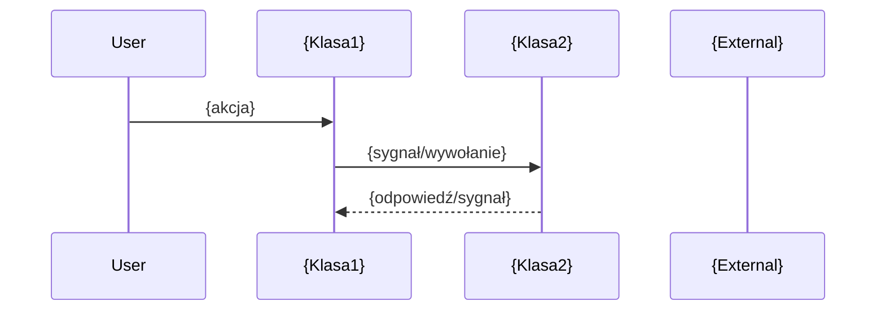

# {PREFIX}-{NNN}: {Tytuł}

## Kontekst biznesowy

{2-4 zdania opisujące po co ta feature istnieje, jaki problem rozwiązuje
i kto jej używa. Zero implementacji, zero technologii.}

## Aktorzy

| Aktor | Rola w tej feature |
|-------|-------------------|
| {np. Operator} | {co robi} |

## Granica funkcjonalności

```
IN SCOPE:
  - {co wchodzi w skład tej feature}

OUT OF SCOPE:
  - {co celowo pominięto} → patrz {PREFIX}-{OTHER}
```

---

## Use Cases

| ID | Aktor | Akcja | Efekt biznesowy | Priorytet |
|----|-------|-------|----------------|-----------|
| UC-1 | {Aktor} | {co robi} | {co osiąga} | MUST |

---

## Reguły biznesowe (Gherkin)

> Pełne reguły z source references. Z facts.md, nie streszczone.

```gherkin
Rule: {Nazwa reguły}

  Scenario: {happy path}
    Given {stan wstępny}
    When  {akcja}
    Then  {oczekiwany efekt}

  Scenario: {edge case}
    Given {warunek graniczny}
    When  {akcja}
    Then  {oczekiwane zachowanie}

  # Źródło: {plik}:{linia} | Pewność: potwierdzone
```

---

## Data Model (tabele DB w scope)

> Z data-model.md — tylko tabele dotyczące tego FEAT.
> Pełny schemat: `data-model.md`

### ERD dla tej feature

```mermaid
erDiagram
    {TABELA_A} {
        int PK_COL PK
        varchar COL1
    }
    {TABELA_B} {
        int PK_COL PK
        int FK_COL FK
    }
    {TABELA_A} ||--o{ {TABELA_B} : "relacja"
```

### Tabela: {NAZWA}

| Kolumna | Typ | Null | Opis |
|---------|-----|------|------|
| {col} | {typ} | {YES/NO} | {opis} |

### Relacje FK

| Źródło | Kolumna | → Cel | PK |
|--------|---------|-------|-----|
| {CHILD} | {fk} | {PARENT} | {pk} |

Jeśli feature nie operuje na DB: "Brak bezpośrednich operacji DB."

---

## API klas w scope

> Z inventory.md — pełne sygnatury metod, parametry, efekty.

### {NazwaKlasy}

**Odpowiedzialność:** {1-2 zdania}
**Pełny opis:** `inventory.md#{NazwaKlasy}`

**Publiczne API:**
| Metoda | Parametry | Efekt | Warunki wywołania |
|--------|-----------|-------|------------------|
| {metoda} | {typy} | {co osiąga} | {kiedy} |

**Sygnały:**
| Sygnał | Parametry | Znaczenie biznesowe |
|--------|-----------|---------------------|
| {sygnał} | {typy} | {co oznacza} |

**Enums:**
| Enum | Wartości | Znaczenie |
|------|----------|-----------|
| {nazwa} | {wartości} | {co reprezentują} |

---

## Protokoły komunikacji (jeśli dotyczy)

> Z SPEC.md Sekcja 9 — komendy używane przez klasy w scope.

| Komenda | Parametry | Odpowiedź | Znaczenie |
|---------|-----------|-----------|-----------|
| {cmd} | {params} | {resp} | {opis} |

Jeśli feature nie komunikuje się przez protokoły: "Brak — feature nie używa protokołów IPC/TCP."

---

## UI Contracts

> Referencje do pełnych kontraktów + kluczowe widgety dla tego FEAT.
> Agent kodujący MUSI przeczytać pełne kontrakty i otworzyć mockupy.
> **OBOWIĄZKOWE:** Załaduj `design-tokens.json` do konfiguracji UI frameworka
> aby zachować spójność kolorów, fontów i spacingu z innymi artefaktami.

**Design Tokens:** `../design-tokens.json`

### {NazwaOkna} — {krótki opis}

**Pełny kontrakt:** `ui-contracts.md#{KLASA}`
**Mockup HTML:** `mockups/{KLASA}.html`

**Kluczowe widgety w scope tej feature:**
| Widget | Typ | Etykieta | Akcja | Slot |
|--------|-----|----------|-------|------|
| {widget_name} | {QtType} | "{label}" | {akcja} | {slot()} |

**Stany widoku (relevantne dla tej feature):**
| Stan | Kiedy | Efekt wizualny |
|------|-------|---------------|

**Walidacje (z source reference):**
| Pole | Reguła | Komunikat | Źródło |
|------|--------|-----------|--------|
| {pole} | {reguła} | "{tekst}" | {plik}:{linia} |

Jeśli feature nie ma UI: "Brak — feature jest backend-only."

---

## Sygnały integracji (z call-graph.md)

### Sequence diagram — główny flow tej feature



**Emitowane (ta feature → inne):**
| Sygnał | Klasa | Odbiorca | Slot | Kontekst |
|--------|-------|----------|------|----------|
| {sygnał()} | {klasa tu} | {klasa tam} | {slot()} | {kiedy} |

**Odbierane (inne → ta feature):**
| Nadawca | Sygnał | Klasa (tu) | Slot | Kontekst |
|---------|--------|------------|------|----------|
| {klasa tam} | {sygnał()} | {klasa tu} | {slot()} | {kiedy} |

Jeśli feature jest izolowana: "Brak — feature nie emituje ani nie odbiera sygnałów."

---

## Platform Independence

| Funkcja | Oryginał | Klon | Priorytet |
|---------|----------|------|-----------|
| {funkcja} | {impl Linux} | [implementator] | CRITICAL/HIGH |

Jeśli feature jest platform-agnostic: "Brak — feature jest platform-agnostic."

---

## Configuration (klucze w scope)

| Klucz | Typ | Domyślna | Wpływ na tę feature |
|-------|-----|---------|---------------------|
| {klucz} | {typ} | {wartość} | {co zmienia} |

Jeśli brak: "Brak konfiguracji specyficznej dla tej feature."

---

## Acceptance Criteria (E2E)

```gherkin
Feature: {Tytuł tej feature}

  Scenario: {Kompletny happy path}
    Given {pełny stan wstępny}
    When  {sekwencja akcji}
    Then  {pełny efekt}
    And   {efekty uboczne}

  Scenario: {Edge case}
    Given {warunek}
    When  {akcja}
    Then  {zachowanie}
```

---

## Open Questions

- [ ] {Pytanie wymagające decyzji przed implementacją}

Jeśli brak: "Brak otwartych pytań — feature gotowa do implementacji."

---

## Working Packages (wstępny podział)

| WP | Opis | Zależności |
|----|------|-----------|
| WP-1 | Domain model: {klasy} | - |
| WP-2 | Data access: {tabele DB} | WP-1 |
| WP-3 | Business logic: {reguły} | WP-1 |
| WP-4 | UI: {dialogi/widgety} | WP-1, WP-3 |
| WP-5 | Integration: {sygnały, protokoły} | WP-3 |
| WP-6 | Tests | WP-1..WP-5 |

*Szacunek wstępny — agent PM może podzielić inaczej.*
