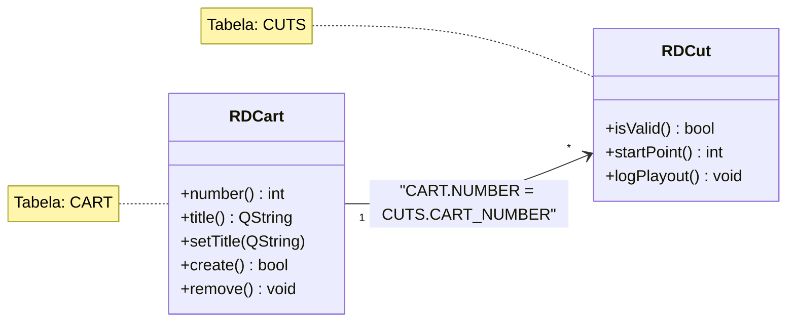

# Data Model: {ARTIFACT_NAME}

## ERD — Entity Relationship Diagram

```mermaid
erDiagram
    {TABELA_A} {
        int ID PK
        varchar NAME
    }
    {TABELA_B} {
        int ID PK
        int A_ID FK
    }
    {TABELA_A} ||--o{ {TABELA_B} : "contains"
```

---

## Tabele

### {TABLE_NAME}

**Klasy CRUD:** {RDKlasa1, RDKlasa2}
**Operacje:** CREATE / READ / UPDATE / DELETE

| Kolumna | Typ | Null | Default | Opis | Mapowanie klasa.pole |
|---------|-----|------|---------|------|---------------------|
| {col} | {typ SQL} | YES/NO | {def} | {opis} | {RDKlasa::getter()} |

<!-- Powtórz dla każdej tabeli -->

---

## Relacje FK

| Tabela źródłowa | Kolumna FK | → Tabela docelowa | Kolumna PK | Typ relacji |
|-----------------|-----------|-------------------|-----------|-------------|
| {CHILD} | {fk_col} | {PARENT} | {pk_col} | N:1 / N:M / 1:1 |

---

## Mapowanie Tabela ↔ Klasa C++

| Tabela DB | Klasa C++ | Wzorzec | Operacje | Plik |
|-----------|-----------|---------|----------|------|
| {TABLE} | {RDClass} | Active Record | CRUD | {file.cpp} |
| {TABLE} | {RDOtherClass} | Read-only | R | {file.cpp} |

---

## Diagram klas — warstwa persystencji

> Relacje między klasami CRUD a tabelami DB.



---

## Uwagi

- Schemat wyekstrahowany z: `{ścieżka do create.cpp lub .sql}`
- Wersja schematu: {N}
- Tabele używane tylko w READ przez ten artifact oznaczone jako "Read-only"
- Tabele z CRUD w tym artifact oznaczone pełnym wzorcem
